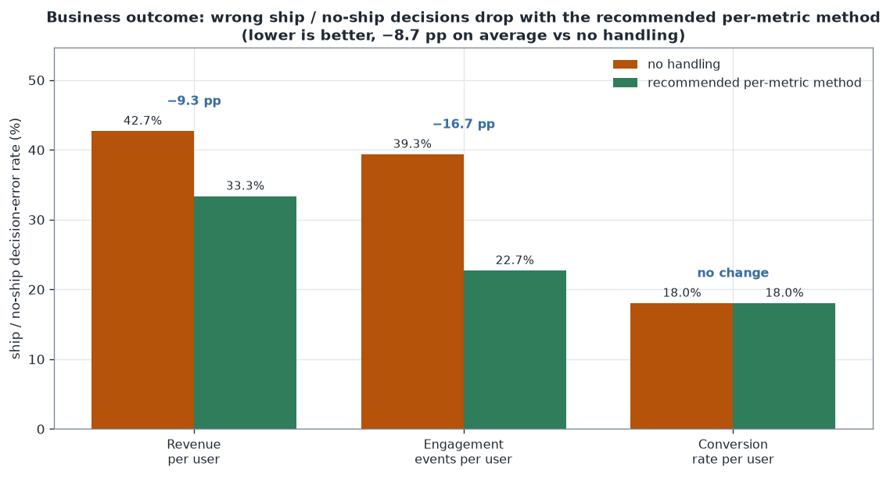
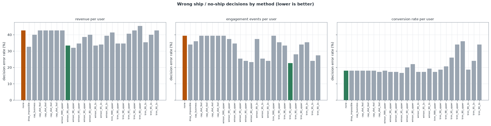
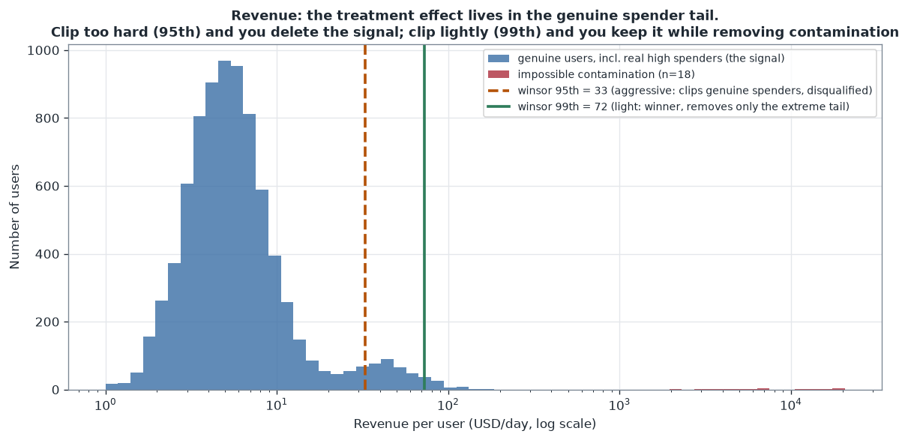
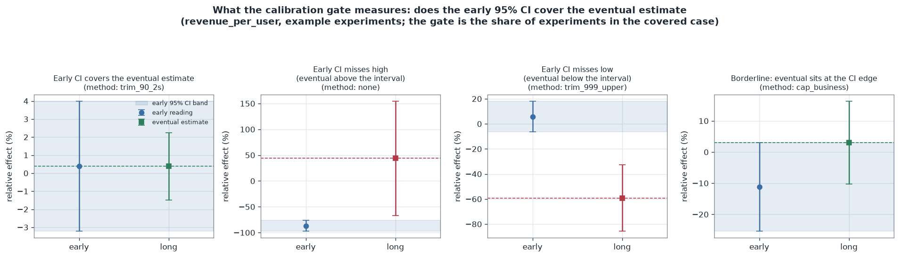
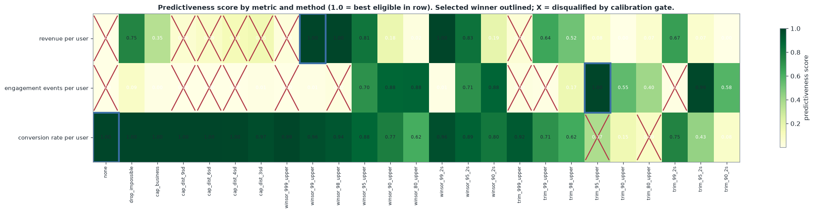
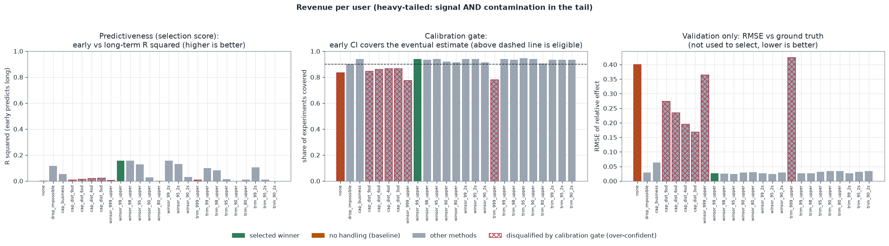
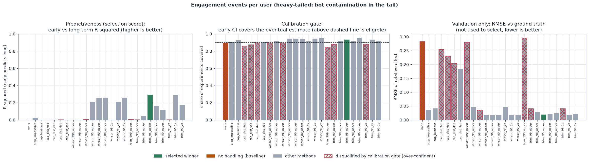
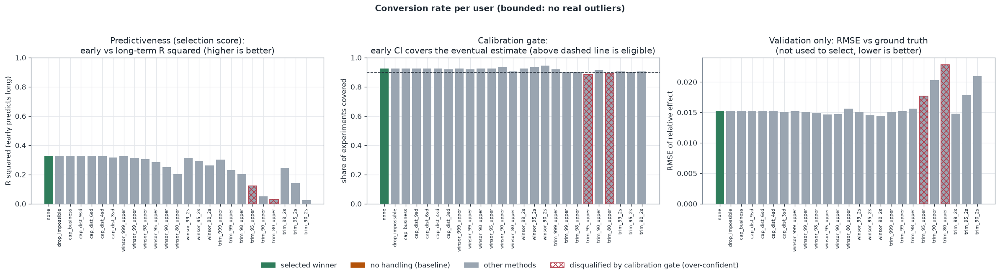
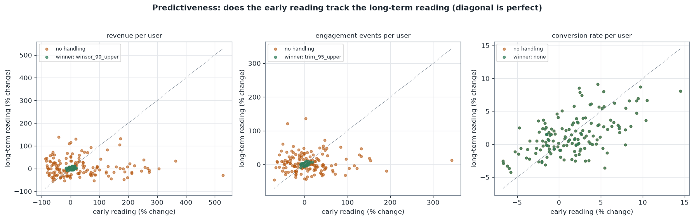

# Guardrail outlier-handling framework

> **This is built on synthetic data.**

**Live demo:** https://k1monfared.github.io/outlier_handling_methods/ , the interactive per-metric method explorer you can open in a browser.

Every experimentation metric can flip an A/B verdict depending on how its
outliers are handled, and today each analyst picks a method by feel, so real wins
stay buried in contaminated variance. This framework selects the outlier-handling
method per metric using only production-measurable signals, calibration coverage
and early-to-long predictiveness, and reserves held-out ground truth to confirm the
call. Across the sampled experiments it recovers 39 true wins that would otherwise
ship nothing at no added risk of a wrong launch, an estimated 82 million USD per
year in avoided decision regret. The central idea: **outliers are not always noise
to remove. Sometimes they are the real signal, so the right handling depends on the
metric.**

A sibling repository, `variance_reduction_methods`, covers CUPED and variance
reduction. CUPED is deliberately excluded here: it is a variance-reduction
technique, not an outlier-handling method. This repo stays focused on outliers.

## Business value and impact

**The headline: the right per-metric outlier handling recovers real wins you would otherwise ship nothing on, at no cost in wrong launches.** Across the sampled experiments it correctly ships **39 more true wins** than doing nothing (revenue 0 to 14, engagement 1 to 26 real wins that finally clear significance), while false ships stay at essentially zero (0 and 1, unchanged). Contaminated variance was hiding those wins, not manufacturing false ones, so the payoff is wins recovered with no added risk of shipping a dud.

In decision terms that is an **8.7 percentage point** drop in wrong ship / no-ship calls on average versus doing nothing, almost all of it recovered wins. The per-metric detail:



| metric | decision-error rate, no handling | decision-error rate, selected method | reduction |
|---|---|---|---|
| Revenue per user | 42.7% | 33.3% | 9.3 pp |
| Engagement events per user | 39.3% | 22.7% | 16.7 pp |
| Conversion rate per user | 18.0% | 18.0% | 0.0 pp (none was already best) |

Most of that error under no handling is missed wins: the contamination inflates variance so much that real wins never reach significance (opportunity cost), with occasional shipped regressions (costly wrong launches). The per-method breakdown is in the decision-quality figure below.



**Illustrative dollar translation (not a real financial result).** Under the transparent, stated assumptions in `configs/experiment_config.json` (each experiment gates a decision affecting 10 million USD of revenue for one year, 500 experiments per year), the reduced decision regret is worth about **82 million USD per year** avoided. This figure is linear in the revenue-at-stake assumption, so treat it as an order-of-magnitude sensitivity, not a point estimate. The robust, assumption-free result is the 8.7-point decision-error reduction. Full derivation is in `outputs/decision_impact.md`.

---

## Outputs

Selection uses only signals you can measure on a live experiment, never the true effect, which you never know in production. The true effect is used only afterward to check that the production-measurable choice was right.

### 1. For revenue-per-user, how should we handle outliers so our A/B call is right?

Use light one-sided winsorization at the 99th percentile (`winsor_99_upper`). It
is selected on production-measurable signals alone, and the ground-truth
validation then confirms it recovers the true effect with RMSE 0.0270 at 0.987 CI
coverage, against RMSE 0.3995 if you do nothing.

How: the framework scored 25 handling methods on the early-to-long predictiveness
(does the short-window reading track the eventual one) behind a calibration gate
(is the early CI accurate about where the experiment lands), never touching the true
effect. `winsor_99_upper` kept the genuine spender tail, where the treatment
effect lives, removed only the impossible logging values, and best preserved that
tracking. Aggressive clipping cut variance more but collapsed the between-experiment
signal, so its predictiveness fell.

So what: set the revenue metric's policy to `winsor_99_upper`. Business-rule
removal `drop_impossible` is an equally defensible fallback.

### 2. Should we just apply one blanket rule across every metric?

No. The three metrics want opposite aggressiveness. Revenue wants light
winsorization (`winsor_99_upper`, its tail is signal), engagement wants aggressive
tail removal (`trim_95_upper`, its tail is bot contamination), and conversion wants
`none` (it has no real outliers).

How: running the same 25-method menu per metric picked the light method for
revenue, an aggressive one for engagement, and no handling for conversion, entirely
on production-measurable signals. Turning each long-term readout into a ship /
no-ship call and comparing it to the ground-truth-correct decision, the per-metric
winners cut the decision-error rate by 8.7 percentage points on average against no
handling (revenue 42.7% to 33.3%, engagement 39.3% to 22.7%).

So what: set the policy per metric, not once for the platform. A single blanket
rule would have been correct for at most one of the three metrics.

### 3. Should we bother cleaning a well-behaved metric like conversion rate?

No. Every method lands within Monte Carlo noise, so `none` wins (validation RMSE
0.0153) and any handling only risks clipping legitimate low-visit users.

How: no method beat no-handling on predictiveness beyond the tie band, and the
decision-error rate was identical at 18.0% with or without handling.

So what: leave conversion rate raw and spend the cleanup effort on the metrics
whose tails actually move the call.

These answers come from three pieces working together: a per-metric comparison of
every handling method on production-measurable signals only, a calibration gate
that disqualifies any method whose early 95 percent CI systematically misses the
eventual estimate (the over-confidence signature of over-aggressive handling), and
a predictiveness score that rewards the method whose short-window read best tracks
the final read. Ground truth is held out and used only to validate the choice. The
sections below document the data, the methods, the criteria, and the full committed
tables.

---

## Contents

- [How to run](#how-to-run)
- [The problem](#the-problem)
- [The core idea, in one picture](#the-core-idea-in-one-picture)
- [How the synthetic data is created, and the goal](#how-the-synthetic-data-is-created-and-the-goal)
- [The methods compared (per metric)](#the-methods-compared-per-metric)
- [The framework criteria](#the-framework-criteria)
- [The calibration gate up close](#the-calibration-gate-up-close)
- [Results: the winner differs across metrics](#results-the-winner-differs-across-metrics)
- [Data-science validation](#data-science-validation)
- [Limitations](#limitations)
- [What a production version would add](#what-a-production-version-would-add)

## How to run

Interactive demo: 
‍‍‍‍‍‍‍
```
sh demo.sh # serves the page on a free local port and opens your browser
```

Single entry point, fully reproducible from the fixed seed:

```bash
python -m venv .venv
source .venv/bin/activate
pip install -r requirements.txt
python scripts/run_demo.py
```

`run_demo.py` regenerates the data bank, runs the analysis, selects the winner
per metric, computes decision quality, and writes everything to `outputs/` and
`docs/images/`. It runs in a few seconds. Individual stages are also available:
`scripts/generate_data.py` and `scripts/generate_figures.py`.

---

## The problem

An experimentation platform reports hundreds of guardrail and success metrics.
Many of them are heavy-tailed or skewed: a few users spend enormous amounts, a
few are bots, a few rows are logging errors. Those extreme values dominate the
mean and its variance, so how you handle them can flip an A/B result from
"ship" to "no-ship".

The usual failure mode is not a lack of techniques. It is that every analyst
picks a different technique, so the whole program drifts like a random walk with
no way to tell whether estimates are getting better or worse. This framework
fixes that by testing every method on equal footing across a representative set of
metrics, selecting one method per metric on production-measurable signals alone,
and using held-out ground truth only to confirm the choice, all with a clear,
reproducible reason.

A tempting shortcut is to apply one blanket policy (for example, "always
winsorize at the 95th percentile") to every metric. This demo shows why that is
wrong: the exact same method is the best choice for one metric and a disqualified,
biased choice for another.

---

## The core idea, in one picture

For a revenue-like metric, the treatment effect lives in the genuine spender
tail. Clip that tail too hard and you delete the signal. Clip it lightly and you
remove only the impossible contamination while keeping the signal.



---

## How the synthetic data is created, and the goal

Data comes first. `scripts/generate_data.py` builds a bank of simulated A/B
experiments across three metric archetypes, each chosen so that outliers mean
something different. Everything is driven by a single master seed
(`20260703`), so the bank is byte-for-byte reproducible.

For every experiment we draw a **known ground-truth relative treatment effect**
(defined on the clean data-generating process, before any contamination). About
35 percent of experiments are true nulls (A/A-like). Each experiment produces
two readings:

- a **long-term** reading (4000 users per arm, effect fully realized), and
- an **early** short-window reading (1000 users per arm, same true effect,
  noisier because there are fewer observations).

The goal of the framework is, per metric, to pick the handling method using only
signals you could compute on a live experiment: the early reading's ability to
predict the long-term reading, and whether the early CI is well calibrated to
where the experiment eventually lands. The known ground-truth effect is never used
to choose. It is held out and used only to validate, after the fact, that the
production-measurable choice actually recovers the true effect. This mirrors
production, where the true effect of a live test is never available, so selecting
by closeness to it is not an option, and the reference you do have is the eventual
long-term reading accumulated over many long-running experiments.

### The three metric archetypes

| metric | distribution | what the outliers are | injected effect |
|---|---|---|---|
| Revenue per user | heavy-tailed (small spenders plus a genuine whale tail) | the tail is BOTH signal (real high spenders) AND contamination (impossible values from a logging bug, far above any real user) | treatment converts more users into big spenders, so the effect lives in the tail |
| Engagement events per user | heavy-tailed counts (Gamma-Poisson humans plus power users) | the tail is contamination (bots and scrapers) that carries no product signal and is not caused by the treatment | modest multiplicative lift spread across the human population |
| Conversion rate per user | bounded 0..1, measured over many visits | none: extreme 0.0 or 1.0 values are legitimate low-visit users, and the metric is naturally robust | multiplicative lift on the per-user conversion probability |

The contamination is injected identically into both arms and is independent of
the treatment, which is exactly what makes it dangerous: it inflates variance and
can swing a finite-sample estimate without reflecting any real change. The whale
tail in the revenue metric, by contrast, IS moved by the treatment, so removing
it removes the effect. Full generative parameters and rationale live in
`configs/experiment_config.json` and `src/data_gen.py`.

The committed bank is `data/metric_bank.parquet` (450 experiments, 4.5M user
readings), with `data/ground_truth.csv` (the injected effects) and
`data/metric_bank_sample.csv` (a small plain-CSV sample for quick inspection).

---

## The methods compared (per metric)

All distribution-based thresholds are computed on the pooled two-arm sample and
applied identically to both arms, so the handling never leaks the treatment
assignment. CUPED is not included: it is variance reduction, not outlier handling,
and lives in the sibling `variance_reduction_methods` repo.

The menu is organized along three levers: **what you do** to a flagged value (do
nothing, clip it, or drop it), **how you flag it** (a fixed domain rule, a
moment-based rule, or an empirical-percentile rule), and **how aggressive** the
threshold is. Every parameterized method is swept across a range of reasonable
settings, so the framework traces the whole accuracy-versus-variance tradeoff
rather than judging one arbitrary cutoff. Lower percentile or lower SD means more
aggressive handling. That is 25 candidates in total.

| Family | Methods (setting swept) | Why it is a candidate a priori |
|---|---|---|
| No handling | `none` | The baseline, and often the right answer. A bounded or light-tailed metric has nothing to gain from handling, so "do nothing" must be a candidate to avoid over-engineering a metric that is already robust. |
| Removal, business rule | `drop_impossible` | Some extreme values are physically impossible (a logging or currency-conversion bug), carry zero information, and sit far above any real user. When a hard domain ceiling exists, dropping those rows is the lowest-bias fix: it deletes only contamination and keeps every genuine value. |
| Capping, business rule | `cap_business` | When a domain ceiling exists but you would rather keep the row than lose sample size, clipping impossible values down to the ceiling bounds their influence without changing n. Included to test a rigid fixed rule against adaptive ones. |
| Capping, distribution (mean + k·SD) | `cap_dist_3sd`, `4sd`, `6sd`, `9sd` | With no domain ceiling, a moment-based cap adapts to the observed scale and bounds the leverage of extreme points at k standard deviations. Sweeping k from 3 (aggressive) to 9 (very light) traces the tradeoff. Worth including precisely because the mean and SD are themselves inflated by the outliers, so this family tends to under-clip heavy tails, a failure mode the results should expose. |
| Winsorization, one-sided upper | `winsor_999_upper`, `99`, `98`, `95`, `90`, `80` | Percentile thresholds adapt to the empirical distribution and are far more robust to the very outliers being handled than a mean-plus-SD rule. Clipping rather than dropping keeps sample size while bounding tail influence. One-sided upper is the natural first choice when only the upper tail is contaminated. The sweep spans light (99.9th, touches only the extreme tip) to aggressive (80th, reshapes the whole upper half). |
| Winsorization, two-sided | `winsor_99_2s`, `95_2s`, `90_2s` | The two-sided variant when both tails carry noise, not just the upper one. A priori appropriate for symmetric heavy tails or metrics where a low-end artifact is also possible. |
| Removal / trimming, one-sided upper | `trim_999_upper`, `99`, `98`, `95`, `90`, `80` | Like winsorization but it drops the flagged rows instead of clipping them, fully removing their leverage. A priori preferable to clipping when the extreme values are pure junk you want gone entirely, at the cost of reduced sample size and, if the tail is genuine, a biased mean. Swept over the same percentile range so removal and clipping can be compared head to head. |
| Removal / trimming, two-sided | `trim_99_2s`, `95_2s`, `90_2s` | Two-sided trimming, the most invasive family, for when both tails are noise and you accept the sample-size cost to eliminate their influence. |

---

## The framework criteria

Selection uses only signals measurable on a live experiment. The reference is the
eventual long-term reading, the estimate you would trust after letting an
experiment run, which in production you accumulate across many long-running
experiments. The true effect is never used to choose. Two stages, defined in
`configs/experiment_config.json` and implemented in `src/framework.py`.

**Stage 1, a calibration gate (validity).** A method may only win if its early 95
percent CI covers the eventual long-term estimate at least 90 percent of the time.
A trustworthy early read should be accurate about its own uncertainty: its interval
should usually contain where the experiment eventually lands. A method whose early
CI systematically misses is over-confident, the signature of over-aggressive
handling that narrows the interval faster than it removes bias. This is measurable
in production, because it compares the early CI to the eventual reading, never to
the unknown truth.

**Stage 2, a predictiveness score.** Among eligible methods, we score how well the
early reading predicts the long-term reading, using the early-to-long R squared
across experiments (how much of the eventual reading's variation the early read
explains), ratio-normalized to the best eligible method so the best scores 1.0.
Within a tie band (6 percent, roughly the Monte Carlo standard error of the
estimate over 150 experiments) the simplest method is preferred: no handling first,
then business rules, then lighter and one-sided winsorization, then two-sided, then
trimming, which is the most invasive because it changes the sample size.

### Why these criteria, and why not the obvious others

- **Why not closeness to the true effect (RMSE, bias, coverage of the truth)?** It
  is the most direct measure of a good estimate and exactly what a synthetic study
  can compute, but it cannot be computed on a live experiment because the true
  effect is unknown. Selecting on it would build a framework that cannot run in
  production. So it is held out and used only to validate.
- **Why not early-to-long RMSE for predictiveness?** It looks production-measurable
  but is gamed by aggressive shrinkage: a method that clips almost everything drives
  both readings toward the same constant, making their RMSE tiny while destroying
  real tracking. R squared collapses under that over-clipping, so it rewards genuine
  predictive power, not variance collapse. In this run, RMSE-scoring picks the most
  aggressive `winsor_80_upper` for every metric with R squared near zero, while
  R squared-scoring picks the sensible per-metric methods.
- **Why not lowest variance or narrowest CI?** Both reward over-shrinkage directly,
  and the narrowest interval is usually the most biased one. Variance you can buy
  down by running longer, so a method that looks precise by throwing away signal is
  a trap. The calibration gate exists to catch exactly this: an over-shrunk method's
  early CI stops covering the eventual estimate.
- **Why a hard gate plus a score, rather than one blended composite?** Bias and
  variance are not interchangeable. A biased-but-precise method should be
  disqualified outright, not allowed to trade its bias against a high stability
  score. The gate encodes "validity is non-negotiable," and the score then ranks the
  methods that clear it. Blending would let a high score buy back a validity failure.

### What this cannot catch, and how production closes the gap

Production-measurable signals reward the method whose early read is stable and
well calibrated to the eventual read. They cannot, on their own, detect a
consistent bias: a method that shifts both the early and the long reading by the
same amount keeps high predictiveness and passes calibration, because the early CI
still covers the equally shifted eventual estimate. The eventual reading itself is
biased, and nothing here reveals that without the truth. The production stand-in for
the truth-coverage check is an A/A test, where the true effect is zero by
construction, so an over-shrinking method exposes itself through an inflated
false-positive rate. 

## The calibration gate up close



The gate counts, for each method, how often the early 95 percent CI contains the
eventual long-term estimate. Each panel is one example experiment: the early
reading with its 95 percent CI (the blue band) against the eventual estimate (the
dashed line and marker). Left to right, the early CI covers the eventual estimate
(the case the gate counts as a pass), misses high, misses low, and a borderline
case where the eventual estimate sits right at the edge of the interval. A method is
eligible only when it lands in the covered case at least 90 percent of the time
across all experiments. An over-aggressive method narrows the early CI so much that
it drifts into the miss cases, which is how the gate screens out over-confidence
without ever seeing the true effect.

---

## Results: the winner differs across metrics



| metric | selected method | why | early to long R2 (score) | early CI covers eventual (gate) | RMSE vs truth (validation) |
|---|---|---|---|---|---|
| Revenue per user | `winsor_99_upper` (light winsorization) | the tail is signal, so clip only the extreme contamination | 0.156 | 0.940 | 0.0270 |
| Engagement events per user | `trim_95_upper` (aggressive upper removal) | the tail is bot contamination, so remove it | 0.294 | 0.933 | 0.0189 |
| Conversion rate per user | `none` (no handling) | no real outliers, so handling only adds risk | 0.327 | 0.927 | 0.0153 |

### The punchline

The three metrics need opposite aggressiveness, and the framework finds it using
only production-measurable signals. Revenue wants light winsorization (its tail is
signal, so clipping hard collapses the early-to-long tracking), engagement wants
aggressive tail removal (its tail is bot junk, so removing it sharpens the
tracking), and conversion wants nothing at all. Two of the three metrics are both
heavy-tailed yet want opposite handling, because in one the tail is signal and in
the other it is junk. A single blanket policy would have been correct for at most
one of the three. The held-out ground truth confirms each choice is also the
accurate one (validation RMSE column), even though the truth was never used to
make it.

### Revenue per user



No handling barely tracks the eventual reading (early-to-long R squared near 0)
because the impossible contamination both dilutes and destabilizes the mean.
Aggressive clipping (the 80th or 90th percentile, or a 3 SD cap) has the lowest
variance but cuts into the genuine spender tail, which collapses the
between-experiment signal and drops its R squared, so it loses on predictiveness.
Light `winsor_99_upper` keeps the genuine spenders, removes only the extreme
contamination, and best preserves the early-to-long tracking, so it wins. The
held-out validation confirms it recovers the true effect (RMSE 0.0270), and
business-rule removal (`drop_impossible`) is a close, equally valid alternative.

### Engagement events per user



Here the tail is bots, which carry no signal, so removing it hard is safe and
correct. `trim_95_upper` drops the bot-inflated tail and gives the highest
early-to-long predictiveness, and the validation confirms it recovers the true
effect (RMSE 0.0189). A fixed business cap underperforms because a count has no
natural ceiling, and light handling (`winsor_999_upper`, `none`) leaves the bots in,
so its early read barely tracks the eventual one. Aggressive winsorization is a
near-equivalent alternative here, the design-intent choice was `winsor_95_2s`, and
the removal variant edges it out on predictiveness in this run.

### Conversion rate per user



Every method performs about the same (RMSE within Monte Carlo noise), so the
framework recommends `none`: the metric has no real outliers, and any handling
only risks clipping legitimate values for no reliable gain. This is the "do not
over-engineer" result.

### Predictiveness, the selection score

The predictiveness score itself is easiest to see as a scatter. Under no handling
the early reading barely predicts the long-term reading (points scatter far from
the diagonal, low R squared). Under the selected method the early reading tracks
the long-term reading closely, which is exactly what the score rewards.



### Confusion matrix of the ship decision (validation)

A final check with the held-out ground truth: turn each experiment's long-term
reading into a ship / no-ship decision (ship when the 95 percent CI lower bound
clears zero) and score it against the correct action, where positive means a real
win that should ship. Each metric shows two rows, no handling against the selected
method, so the contrast is direct.

| metric | handling | real wins shipped (TP) | false ships (FP) | missed wins (FN) | correct holds (TN) | precision | recall |
|---|---|---|---|---|---|---|---|
| Revenue per user | none | 0 | 0 | 64 | 86 | 0.00 | 0.00 |
| Revenue per user | `winsor_99_upper` (selected) | 14 | 0 | 50 | 86 | 1.00 | 0.22 |
| Engagement events per user | none | 1 | 1 | 58 | 90 | 0.50 | 0.02 |
| Engagement events per user | `trim_95_upper` (selected) | 26 | 1 | 33 | 90 | 0.96 | 0.44 |
| Conversion rate per user | `none` (selected) | 37 | 2 | 25 | 86 | 0.95 | 0.60 |

The selected methods are high-precision, almost no false ships, but conservative
on recall, because the ship rule demands a statistically clear win. The value of
handling shows up as recovered real wins. Under no handling the same rule ships 0
of 64 real revenue wins (recall 0.00) and 1 of 59 engagement wins (recall 0.02),
because the contaminated variance keeps them from reaching significance. Handling
the tail lets 14 and 26 of those real wins clear the bar, which is exactly the
missed-win reduction behind the decision-error numbers at the top. The full
per-method confusion counts, including the no-handling baselines, are in
`outputs/decision_impact.md`.

---

## Data-science validation

Every number and figure is produced by the actual run from the fixed seed,
nothing is hand-entered. For each of the 25 methods on each of the 3 metrics the
run reports, across 150 experiments each:

- the production-measurable selection signals: the early-to-long predictiveness
  (R squared, the score) and the early-CI calibration (how often the early CI
  covers the eventual estimate, the gate),
- the held-out ground-truth recovery used only for validation: bias, variance,
  RMSE, and 95 percent CI coverage of the estimate against the known true effect,
  and
- decision quality (false-ship, missed-win, and total error rates).

See `outputs/per_metric_results.md` for the full tables and
`outputs/framework_results.json` for the machine-readable results. A null-effect
(A/A) subset is included in every metric so the validation coverage and false-ship
rates are meaningful.

---

## Limitations

- Synthetic data. The generative processes are stylized to make each metric's
  outlier structure legible. Real distributions are messier and metrics can shift
  category over time.
- The metric mean is the estimand throughout. Ratio metrics, quantile metrics,
  and cluster-randomized designs need their own treatment.
- The calibration gate uses a single threshold (0.90) and the tie band a fixed 6
  percent. Both are configurable and would be tuned, ideally learned per metric
  from a bank of long-running experiments.
- Production-measurable signals cannot detect a consistent bias. A method that
  shifts both the early and the long reading equally keeps high predictiveness and
  passes the calibration gate, because the early CI still covers the equally shifted
  eventual estimate, yet the eventual estimate itself is biased. Here the held-out
  truth reveals that; in production it is caught with A/A tests (see below), not by
  the selection signals alone.
- The dollar figure is illustrative and linear in a stated assumption, not a
  measured financial outcome.
- Effects are held constant between the early and long-term readings, so this repo
  isolates outlier handling from novelty and ramp effects. Time-varying effects
  are the subject of a separate novelty-effect analysis.

## What a production version would add

- **An A/A false-positive gate**, the lead item. The one thing production-measurable
  predictiveness and calibration cannot catch is a consistent bias. A/A experiments
  (true effect zero by construction) close that gap: a well-behaved method rejects
  the null about 5 percent of the time, and an over-shrinking method that narrows
  its CIs shows an inflated false-positive rate, so it can be disqualified without
  ever knowing a live experiment's true effect. This is the production analog of the
  truth-coverage check this framework deliberately does not use for selection, and
  it would restore a bias guard on fully production-measurable footing.
- **A graded calibration score instead of a binary gate.** Rather than only asking
  whether the eventual estimate falls inside the early 95 percent interval (a 0/1
  indicator thresholded at 90 percent), score each experiment by the p-value of the
  long-term estimate within the early estimate's sampling distribution, that is,
  where the eventual value lands in the early normal, its probability-integral
  transform. A well-calibrated method produces these p-values uniformly on 0 to 1,
  while a systematically over-confident method piles them up near 0 and 1. Scoring
  the whole distribution of these p-values (for example by their distance from
  uniform) uses far more information than a single coverage rate and grades
  near-misses and near-hits continuously instead of at one hard cutoff.
- **Per-metric gate and tie-band thresholds learned from a bank of long-running
  experiments**, rather than the single global 0.90 / 6 percent used here.
- **A hierarchical model** that shares the accuracy-variance tradeoff across related
  metrics and past experiments, so a new metric starts with an informed prior on how
  aggressively to handle its tail.
- **Sequential, always-valid confidence intervals** so the calibration check holds
  under continuous monitoring and early peeking, not just at the two fixed readings
  used here.
- Direct implementation in the query layer (SQL or the metrics library), so the
  chosen per-metric handling is applied automatically at read time.
- An automated meta-analysis over real historical experiments that re-selects the
  method per metric on a schedule and alerts when a metric's outlier structure
  drifts.
- Metric-family-aware defaults and a review workflow for new metrics.
- Extension to ratio and quantile metrics and to cluster-randomized designs.
